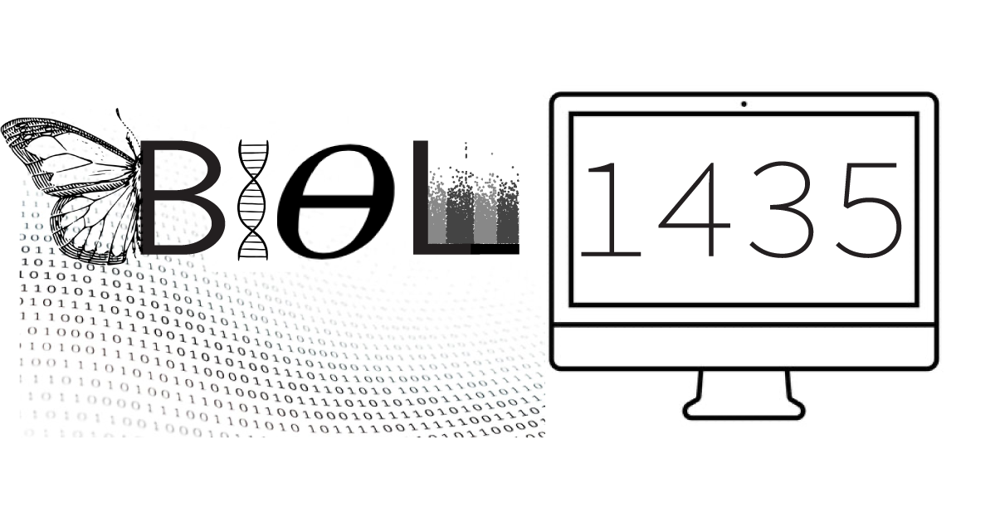

# Computational Population Genetics (BIOL 1435)

 

Welcome to the BIOL 1435 course repository! BIOL 1435 is designed for upper-level undergraduate and graduate students or for anyone interested in learning about population genetic theory and how to apply those concepts to simulated and publicly available genomic datasets. By the end of this course, students will have (1) an improved understanding of core concepts in population genetics; (2) gained some level of fluency with the Python programming language; (3) learned how to model and simulate genetic variation within and between population(s); (4) applied the course material to publicly available genetic datasets to make inferences about the evolutionary history of humans and other taxa; (5) analyzed, critiqued, and presented primary journal articles to understand how said articles have advanced the field and/or instigated debates within the field. This repository contains all the code used to generate lecture materials, in-class exercise notebooks, problem sets, and other helpful resources. Please note that since this is an active Brown University course, the in-class quizzes and problem set answer keys are not posted on this repository. Instructors and non-Brown University students can submit a GitHub issue requesting access to these resources.

## Anaconda Environment

BIOL 1435 utilizes Brown University's Jupyter Hub server to avoid troubleshooting on students' personal computers. You can run the following code to replicate the course's Anaconda environment for your own personal use.

```bash
# Create the BIOL 1435 conda enviornment.
conda env create -f biol1435.yaml
```

## Repository Overview

```bash
├── lectures
│   ├── data
│   ├── exercise_notebooks
│   ├── figure_notebooks
│   ├── figures
│   ├── recordings
│   └── slides
├── problem_sets
│   ├── ps1
│   ├── ps2
│   ├── ps3
│   └── ps4
└── student_resources
    ├── examples_and_tutorials
    ├── logistics
    └── previous_final_projects
```

- `lectures`: Materials used in class.
  - `data`: Data used for lecture material and in-class exercises.
  - `exercise_notebooks`: Jupyter notebooks for in-class exercises.
  - `figure_notebooks`: Jupyter notebooks used for generating figures for lectures.
  - `figures`: Figures used in lectures.
  - `recordings`: Lecture recordings.
  - `slides`: Lecture slides.
- `problem_sets`: Materials used for creating problem sets.
  - `ps1`: Problem set materials associated with Module 1: Introduction to BIOL 1435 & Evolutionary Genetics.
  - `ps2`: Problem set materials associated with Module 2: Introduction to Coalescent Theory & Tree-Thinking.
  - `ps3`: Problem set materials associated with Module 3: Population Differentiation & Demography.
  - `ps4`: Problem set materials associated with Module 4: Selection.
- `student_resources`: Resources for current and future students.
  - `examples_and_tutorials`: Materials for help with derivations, coding, and how to read a scientific paper.
  - `logistics`: Course syllabus and rubrics.
  - `previous_final_projects`: Selected final projects from previous students.

## Helpful Resources

* Brown's Center for Computation and Visualization
  * [Jupyter Hub Documentation](https://docs.ccv.brown.edu/jupyterhub/)
  * [OSCAR Documentation](https://docs.ccv.brown.edu/oscar/)
  * If all else fails and you can't find a solution after looking through the documentation or Google email  [support@ccv.brown.edu](mailto:support@ccv.brown.edu)
* Python Tutorials
  * [Jerry Pussinen's Python3 Course](https://github.com/jerry-git/learn-python3)
  * [UNC's Training in Biomedical & Biological Sciences Python3 Course](https://github.com/How-to-Learn-to-Code/python-class)
  * [Jam3's Math as Code Examples](https://github.com/Jam3/math-as-code/blob/master/PYTHON-README.md)
* Free Evolutionary Genetic Resources
  * [Graham Coop's PopGen Notes](https://github.com/cooplab/popgen-notes)

## Suggested Workflow

When I started my Ph.D. in 2020, I transitioned from a majority wet-lab to a completely dry-lab environment and did not have a strong statistical thinking background nor any experience coding in Python. Consequently, outside of developing a course for Brown University, a huge motivation for me was to create a set of materials for those starting out in population genetics research. For those who are not Brown University students taking BIOL 1435 below you will find a suggested outline for self-paced learning. If, during your self-paced learning experience, you encounter unanswered questions or need any clarifications, please submit a GitHub issue, and I will try my best to address it in a timely fashion. **NOTE:** This repository should viewed as a beginner's guide for those interested in theoretical aspects of and computational approaches in population genetics. Consequently, several important topics in population genetics are not covered in the material, and the material tends to lean toward my broader interests.

- Module 0: Python Programming
  - If you don't have experience coding in Python first work through the three Python tutorials.
- Module 1: Introduction to BIOL 1435 & Evolutionary Genetics
  - Lecture: [welcome_to_biol1435_2k23.pdf](https://github.com/David-Peede/BIOL1435/blob/main/lectures/slides/welcome_to_biol1435_2k23.pdf)
    - Read: 1000 Genomes Project Consortium. "A global reference for human genetic variation." Nature 526.7571 (2015): 68.
    - Read: Korunes, Katharine L., and Kieran Samuk. "`pixy`: Unbiased estimation of nucleotide diversity and divergence in the presence of missing data." Molecular ecology resources 21.4 (2021): 1359-1368.
  - Lecture: [diversity_and_variation_2k23.pdf](https://github.com/David-Peede/BIOL1435/blob/main/lectures/slides/diversity_and_variation_2k23.pdf)
    - Exercise: [diversity_and_variation_2k23.ipynb](https://github.com/David-Peede/BIOL1435/blob/main/lectures/exercise_notebooks/diversity_and_variation_2k23.ipynb)
    - Read: Rosenberg, Noah A., and Magnus Nordborg. "Genealogical trees, coalescent theory and the analysis of genetic polymorphisms." Nature Reviews Genetics 3.5 (2002): 380-390.
  - Problem Set: [ps1](https://github.com/David-Peede/BIOL1435/tree/main/problem_sets/ps1)
    - Optional: Submit a GitHub issue to check your answers.
- Module 2: Introduction to Coalescent Theory & Tree-Thinking
  - Lecture: [wf_and_coal_theory_2k23.pdf](https://github.com/David-Peede/BIOL1435/blob/main/lectures/slides/wf_and_coal_theory_2k23.pdf)
    - Exercise: [intro_to_msprime_2k23.ipynb](https://github.com/David-Peede/BIOL1435/blob/main/lectures/exercise_notebooks/intro_to_msprime_2k23.ipynb)
    - Read: Patterson, Nick, et al. "Genetic evidence for complex speciation of humans and chimpanzees." Nature 441.7097 (2006): 1103-1108.
    - Read: Patterson, Nick, Alkes L. Price, and David Reich. "Population structure and eigenanalysis." PLoS genetics 2.12 (2006): e190.
    - Bhatia, Gaurav, et al. "Estimating and interpreting $F_{ST}$: the impact of rare variants." Genome research 23.9 (2013): 1514-1521.
  - Problem Set: [ps2](https://github.com/David-Peede/BIOL1435/tree/main/problem_sets/ps2)
    - Optional: Submit a GitHub issue to check your answers.
- Module 3: Population Differentiation & Demography
  - Lecture: [pop_structure_2k23.pdf](https://github.com/David-Peede/BIOL1435/blob/main/lectures/slides/pop_structure_2k23.pdf)
    - Exercise: [pop_structure_and_pca_2k23.ipynb](https://github.com/David-Peede/BIOL1435/blob/main/lectures/exercise_notebooks/pop_structure_and_pca_2k23.ipynb)
    - Read: Kartzinel, Rebecca Y., et al. "Divergence and isolation of cryptic sympatric taxa within the annual legume *Amphicarpaea bracteata*." Ecology and evolution 6.10 (2016): 3367-3379.
    - Read: Durand, Eric Y., et al. "Testing for ancient admixture between closely related populations." Molecular biology and evolution 28.8 (2011): 2239-2252.
    - Read: Dagilis, Andrius J., et al. "A need for standardized reporting of introgression: Insights from studies across eukaryotes." Evolution Letters 6.5 (2022): 344-357.
    - Read: Brandvain, Yaniv, et al. "Speciation and introgression between *Mimulus nasutus* and *Mimulus guttatus*." PLoS genetics 10.6 (2014): e1004410.
  - Lecture: [introgression_2k23.pdf](https://github.com/David-Peede/BIOL1435/blob/main/lectures/slides/introgression_2k23.pdf)
    - Exercise: [introgression_simulations_2k23.ipynb](https://github.com/David-Peede/BIOL1435/blob/main/lectures/exercise_notebooks/introgression_simulations_2k23.ipynb)
    - Read: Rosenzweig, Benjamin K., et al. "Powerful methods for detecting introgressed regions from population genomic data." Molecular ecology 25.11 (2016): 2387-2397.
    - Read: Eyre-Walker, Adam. "The genomic rate of adaptive evolution." Trends in ecology & evolution 21.10 (2006): 569-575.
    - Read: Charlesworth, Brian, and Jeffrey D. Jensen. "Effects of selection at linked sites on patterns of genetic variability." Annu Rev Ecol Evol Syst 52.1 (2021): 177-197.
  - Problem Set: [ps3](https://github.com/David-Peede/BIOL1435/tree/main/problem_sets/ps3)
    - Optional: Submit a GitHub issue to check your answers.
- Module 4: Selection
  - Lecture: [natural_selection_2k23.pdf](https://github.com/David-Peede/BIOL1435/blob/main/lectures/slides/natural_selection_2k23.pdf)
    - Exercise: [natural_selection_2k23.ipynb](https://github.com/David-Peede/BIOL1435/blob/main/lectures/exercise_notebooks/natural_selection_2k23.ipynb)
    - Read: Huerta-Sánchez, Emilia, et al. "Altitude adaptation in Tibetans caused by introgression of Denisovan-like DNA." Nature 512.7513 (2014): 194-197.
    - Read: Calfee, Erin, et al. "Selective sorting of ancestral introgression in maize and teosinte along an elevational cline." PLoS genetics 17.10 (2021): e1009810.
  - Problem Set: [ps4](https://github.com/David-Peede/BIOL1435/tree/main/problem_sets/ps4)
    - Optional: Submit a GitHub issue to check your answers.

## Course Development

This repository contains the course material for the Spring 2023 semester of BIOL 1435. As this was my first semester teaching as the instructor of record, the lecture material should be continually refined and additional topics added. Moving forward, I anticipate the course material being updated on an annual basis after my amazing PI, Dr. Emilia Huerta-Sánchez, is done teaching this course in the spring. However, I encourage feedback on existing course material and the addition of new course material! For general feedback, feel free to submit a GitHub issue with your comments, and to add updates or new material, please submit a pull request!

## Spring 2K23 Important Dates

__NOTE:__ All PDFs of the readings can be found on the course canvas page.

|  Date   |                        Notes                         |
| :-----: | :--------------------------------------------------: |
| 2FEB23  | Problem set 1 assigned (due by 11:59 pm on 16FEB23). |
| 7FEB23  |                    Module 1 quiz.                    |
| 16FEB23 |            Problem set 1 due by 11:59 pm.            |
| 16FEB23 | Problem set 2 assigned (due by 11:59 pm on 2MAR23).  |
| 23FEB23 |                    Module 2 quiz.                    |
| 2MAR23  |            Problem set 2 due by 11:59 pm.            |
| 8MAR23  | Problem set 3 assigned (due by 11:59 pm on 24MAR23). |
| 9MAR23  |       Final project proposals due by 11:59 pm.       |
| 23MAR23 |                    Module 3 quiz.                    |
| 24MAR23 |            Problem set 3 due by 11:59 pm.            |
| 7APR23  | Problem set 4 assigned (due by 11:59 pm on 30APR23). |
| 25APR23 |                    Module 4 quiz.                    |
| 30APR23 |            Problem set 4 due by 11:59 pm.            |
| 10MAY23 |        Final project reports due by 11:59 pm.        |

